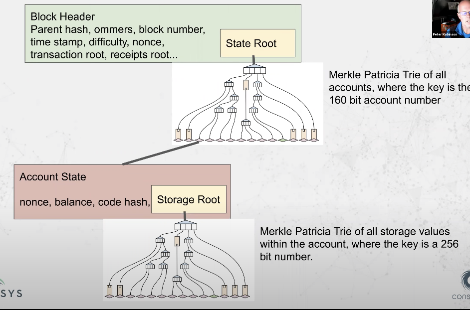

## High Level Overview

When you write Solidity code it goes through a process like this:

- `myContract.sol`  → solc compiler → `.bin` (raw bytecode) → `.abi`  (interface file for Web3 frontends and applications to interact with contract)

The ABI is then used by a Web3 library to interact with a local or remote Ethereum node.

- web3 application → web3 library (ex. web3js/ethers) → Ethereum Client (instance of software running on a node on the network) → EVM

## VM Deep Dive

The EVM (Ethereum Virtual Machine) is a stack based VM in comparison to register based VMs like (x86 and ARM). All VMs at a low level run instructions/opcodes by going through a an execution loop that looks like:

1. Fetch instruction at PC (program counter)
2. Execute
3. If JUMP, set PC to new target
4. Else, increment PC 

Characteristics of a stack based machine:

- Instructions take paramters from the stack and write results to the stack
- Each instruction has stack inputs, parameters, stack outputs, and return values
- All instructions are encoded on 1 bytes ([useful reference](obsidian://open?vault=Ethereum&file=Bytes%2C%20Bits%2C%20and%20Hex))
- Every instruction (aka. opcode) instruction is assigned a value between 0 and 255

## Comparison with Existing Technology

The EVM operates on a more limited domain similar to JVM, which is agnostic of the underlying operating system allowing it to function in several systems. High level languages like Java (JVM) and C# (.NET) are compiled into bycode instruction sets defined by their specific machine. For the EVM, the languages supported are Solidity, LLL, Serpent, and Vyper.

The EVM has no scheduling capability and is entirely single threaded, which means that the ordering is contained in a single sequence and defined by verified block transactions organized by Ethereum clients.

EVM is a stack based computer, which can be thought of as a global dectralized computer with millions of execution objects. It is considered **quasi-Turing-complete** meaning that it has the capabilities of a **Turing-complete** system with limitations on computation by the amount of gas supplied.

Limiting the gas supplied solves two big problems:

- **Halting problem** which refers to the case where programs might halt
- Avoids situations where bad actors can deploy programs that run forever (DOS attack)

It is important to note the a transfer of value between one externally owned account (EOA) does not involve the use of EVM, but changes to global state do (particularlly with smart contracts). 

The EVM has special functionality and features that are geared towards usage on the Ethereum network. These features include:

- Addressing the halting problem (mentioned later) with gas
- Storage and memory primitives
- Execution contexts (caller, owner, balance, etc)
- Quality of life functions (type casting and keccak256)
- Cross contract communication 
	- `call()`
	-  `delegatecall()`
	- `return()`
	- `revert()`

## EVM Environment

When smart contract creation is executed, context is created and an EVM is instantiated. If at any point there is an out of gas (OOS) exception, execution halts and transaction is abandoned. You can think of EVM running on sandbox version of world state, because entire sandbox is discarded if exception arises. If transaction completes successfully then world state is updated to match sandbox state.

Each call to another contract instantiates an EVM and any exception causes the EVM to be discarded and return to the EVM a level above.

Take for example the following call chain 
`Contract A  → Contract B → Contract C`

If contract B's call to contract C reverts, then the EVM containing contract C's state is discarded and the active state becomes contract B's.

### EVM Data Storage

#### The Code

Region where instructions are stored and cannot be modified (refer to [[Smart Contracts & Opcodes]]). Read with instructions `CODESIZE` and `CODECOPY` , external code can also be read with `EXTCODESIZE` and `EXTCODECOPY` . It contains the PC (program counter) encoded which indicates the instruction that should be read next by EVM

In an EOA (externally owned account), this code region is empty.

#### The Stack

**Non-persistent** in that it does not exist once transaction is complete. It is a list of 32 byte elements and it is used to place parameters needed by instructions and result values. New values are placed at top of stack and only top values used by instructions.

#### The memory

Memory is a **volatile** region that exists only during smart contract execution and is accessed with byte offsets. All address space is available and initialized to 0. Size of memory is counted with highest address that was accessed (refer to memory expansion)

#### The storage

**Persistent** memory of smart contract mapping of 32 byte slot to 32 byte value, where each value is kept until set to 0 or self destruct. Used with `SLOAD` `SSTORE`.

Block header → Account state (visualization of smart contract storage in respect to account state and block headers)

#### Call data

Region that is sent with transaction. (ex. for contract creation the calldata would be constructor code). Considered immutable and can be read with opcodes like `CALLDATALOAD` `CALLDATASIZE` `CALLDATACOPY`

#### Return Data

Region that smart contract can return value after call set through return() revert() and read by calling contract with `RETURNDATASIZE` and `RETURNDATACOPY`

[[Smart Contracts & Opcodes]]

[[Bytes, Bits, and Hex]]

