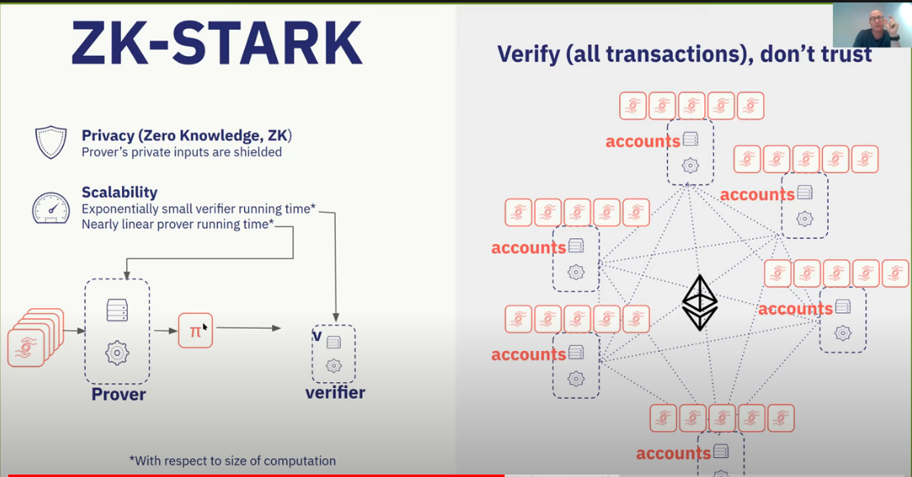
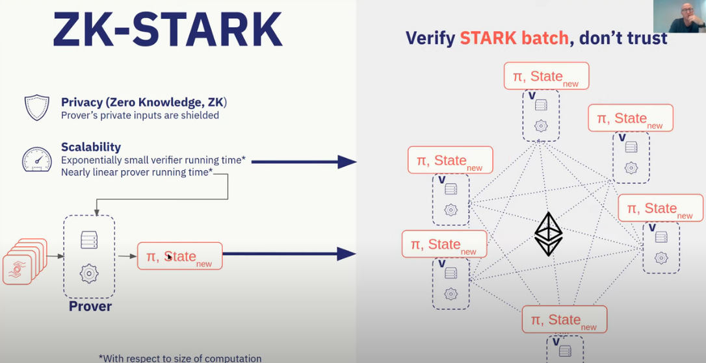
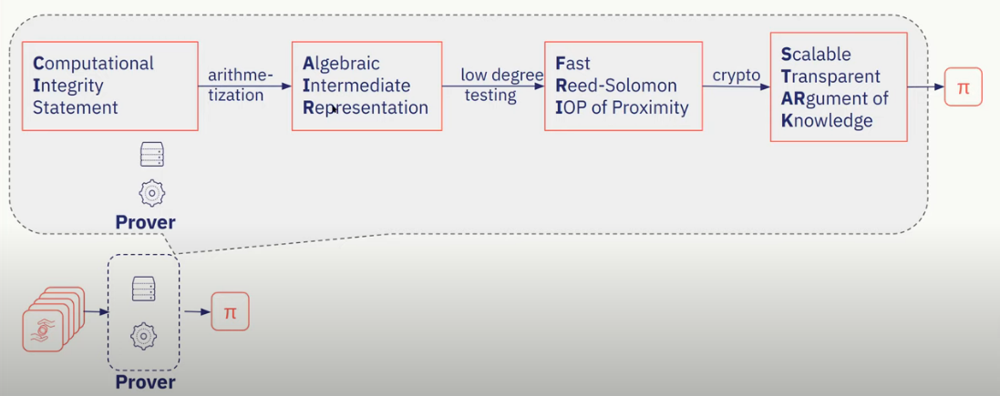

## Overview

**How do we provide both scalability and integrity on the Blockchain?** Blockchains are secure decentralized and trustless. Transactions onchains are able to leverage the benefits of the blockchain; however, they are costly because of the blockchains capacity. On the flipside, transactions offchain through an operator are infinitely scalable, but they require users trusting the integrity the operator.

## A scenario

A politician is running for mayor and is offered the position provided that he/she hasn't comitted any crimes. A DNA database stored by authorities contains all criminal data to ever occur. The politician argues that if he/she had comitted a crime then they would appear in the DNA database. However in order to prove this argument, one would have to check every entry in the database to ensure that the DNA of the politician was not in it.

**Assumptions:**
- You have no trust assumptions about the prover, could be malicious
- Prover wants to prove an integrity statement and does do by prodiving a proof to convince verifier

**Overaching Issues:**
- A large database would take an infeasible amount of time to process this check
- A database would have to be exposed to the public to ensure validity, which introduces a privacy violation 

One might think that  a potential compromise would be to give the DNA sample to third party to perform check, but that relies on users trusting the integrity of the third party. Another solution one might think of is to check every entry; however, the computation time is not manageable for large sizes.

## zk-STARKS

### Starks, Cairo, and StarkNet
- Why learn Cairo?
	- Build L2 dApps with L1 security and exponentially greater throughput
- How do we scale with Cairo?
	- Computational intergity of Cairo runs automagically, efficiently, STARK proved and placed on blocked
- Computational integrity
	- "Perform computations with integrity on L2 where no one can see as if it were on L1"
	- Reputation, delegated accountability (ex. banks)
		- Society delegates accountants, lawyers, etc.
	- Naive replay (ex. Bitcoin, Ethereum L1)
		- Everyone is invited to recompute and prove it's validity
	- Trusted Execution Environments (ex. EVM, Intel's SGX)
		- Assume physical computer that cannot be tampered with, which is encrypted and can sign over its correct executions
	- Fraud Proofs (ex. Optimistic Rollups - other solution)
		- Combination of naive replay, delegated accountability, and game theoretic incentives
	- Cryptographic proofs
		- zk-STARKS in StarkNet

**Features:**
- Privacy (zero knowledge, ZK)
- Scalability 
	- Expontentially small verifier run time and near linear prover run time
- Universality 
	- Applicability to general computation
	- Cairo is the primary language for writing programs that you get efficient stark proofs
- Transparency
	- No toxic waste
- Lean and battle hardened cryptography

Instead of relaying all transactions and across the network, we can have zero trust in the prover and still be able to verify the validity of it's new network state given the proof.



### AIR-FRI STARK



1. Computational Integrity statement is fed to the prover
2.  Arithmetization breaks up subject trying to prove into a bunch of polynomial contraints known as AIR (R1CS)
3. Low degree testing is conducted through FRI
4.  Cryptography applied to make everything communicable and leads to a STARK (proof)

 - CI + AIR depend on CI statement, while FRI AND STARK do not depend on the CI statement
 - Transition function bridges the two
 - Every time you have a separate statement for example NFT trading and perpetual contract a new AIR will need to be built for a new set of constraints
 - Cairo (CPU AIR) solves this by sending statements to a compiler which reduces everything to Cairo bytecode which is then sent as input to universal AIR

![[Pasted image 20220326054101.png]]

### Cairo

What is Cairo? Cairo is the first universal Von Neumann STARK Architecture (proof system).
- Universal 
- Scalable 
- Transparent 
Cairo as MVL - Minimum Viable Language for production STARK systems
- **Goldilocks principle:** "just right" balance of expressiblity and STARK prover efficiency
- **Neither too hot (simple):** 3 registers (PC, allocation pointer, frame pointer) and minimal instruction set
- **Nor too cold:** support functions, recursion, branching, etc.

#### Dive into cairo

The Cairo Programming language was designed for STARK proof efficiency with immutable memory and field elements as native type. It is still in its infancy so it's constantly improving. Cairo is built on components called builtins that provide efficient ways to run non-trivial computations like hashes, signatures, and range checks.

#### Hello CAIRO

```cairo 
# Computes the sum of the memory elements at addresses:
#   arr + 0, arr + 1, ..., arr + (size - 1).
func array_sum(arr : felt*, size) -> (sum):
    if size == 0:
        return (sum=0)
    end

    # size is not zero.
    let (sum_of_rest) = array_sum(arr=arr + 1, size=size - 1)
    return (sum=[arr] + sum_of_rest)
end
```

**Felt** (field elemnt) is a primitive type that is defaulted when an argument type is not specified. A "field element" in Cairo is denoted as a integer in the range -P/2 < x < P/2 where P is a very large prime number (currently 252 bits).

The difference between integers and field elements is division. Division of field elements (or division in Cairo) is not the normal integer division.

In many programming languages `7/3 = 2` because the integral part of the quotient is returned. However, in Cairo `7/3 can be rewritten as 3 * x` where if 3 * x is outside the range -P/2 < x < P/2 an overflow can occur bringing it back down to 7 meaning x will return a very large number. In most code, unless very algebraic, you will not encounter this and you are able to treat field elements as if they were integers. 

---

## What are Zero Knowledge Proofs?

You want to prove that you know an `x` such that `f(x)=y` **without revealing x.**  In reference to the former example, you want to prove that the database does not include the politician without revealing the database. 

Requirements to a ZK Proof:
- Encoding as a polynomail problem
- Succinctness by random sampling (acquire non-linear property - proof is smaller than size of data set)
- Zero knowledge (privacy)

**Example #1** 
You want to prove that you got a particular value after a certain number of steps.

1. "This program reaches value x=42 after 1000 steps"
	1. `x=1`
	2. `while true { x = x^2 - 5x + 7 }`
3. Naive verification
	1. Check for each i < 999 that x<sub>i+1</sub> - x<sub>i</sub> - 6x<sub>i</sub> + 7 = 0
2. Problem? Prover can cheat at any point x<sub>i</sub> to reach faulty answer
	1. Solution: add redundancy by encoding execution trace with ECC, so that errors in one place would snowball into many other errors

**Example #2**

1. You want to prove that you have a polynomial such that `1 <= P(x) <= 9` for all `1 <= x <= 1,000,000` 
	1. Computing all 1,000,000 would result in a certificate size equal to the data set size, which violates non-linear property
2. Let C(x) be a polynomial such that C(x) = 0 only if `1 <= x <= 9` 
	1. C(x) = (x-1)(x-2)(x-3)(x-4)...(x-9)
3. Now the problem becomes prove you know P(x) such that C(P(x)) = 0 for 1 <= x <= 1000000

```
Theorem: Any polynomial that equals zero at all x within a range is a multiple of Z(x)

Z(x) = (x-1)(x-2)....(x-100000)
```

4. Now the problem becomes prove you know P(x) and D(x) such that C(P(x)) = Z(x)D(x)
5. Commit all values of P(x) up to 1,000,000,000 (more values than before) to a merkle tree. Polynomials amplify errors that become more prevalant when computing more data.
6. However, there is a possibility that a valid P(x) was provided but not the exact P(x)
	1. Low Degree Testing

## zk-SNARKS

1.  **Succint** - proof is small and easy to verify even if context is complex
2. **Non-interactive** - no need for back and forth interaction between verifier and prover 
3. Argument - cryptography and non-determinism, not traditional formal proofs
4. of Knowledge - prover knows the subject he/she is proving not just proving a proof of it's existence


--- 
- https://www.youtube.com/watch?v=kk1Oo42TVQk
- 