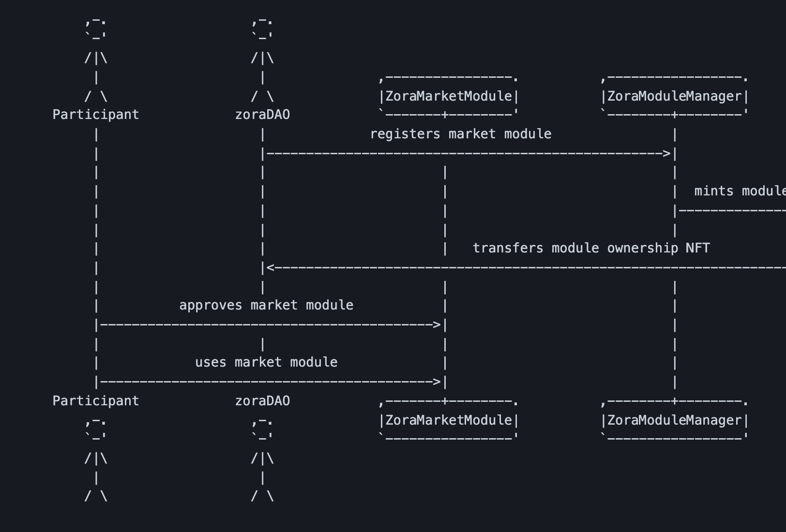

# Protocols

This page is for a general overview of each protocol. If you want a technical dive into each repository, feel free to refer to the backlinks.

## Cosmos

## GnosisSafe

## ZORA
### Overview
- In V1, it was permissionless in the sense that if the media source (contract) included the ZORA marketplace then you can trade without being hindered by a marketplace (ex. Opensea collection takedowns) because you own the marketplace and media
	- Issue being that when people started to design novel implementations of their media it became difficult to replicate/remix the media in the market
- Zora NFT v2 had marketplace contracts/interface baked into the NFT contracts of individual NFT contracts similar to Opensea
- In V3, ZORA moved towards a permissionless auctionhouse protocol that is a permissionless onchain model that is functional with any 721 compliant NFT
	- This is extremely beneficial because it makes it easy for other protocols (ex. Fractional) to integrate since everything operates on chain, while integrating Opensea would require significant resources to manage off-chain and on-chain interactions

-  Participant approves market module for media and funds which gives access for modules to facilitate transactions without further approvals. The market module has access to all the different currencies approved in the module, which it can use to delegate to different market modules.
	- Example: You approved the market module for USDC and a particular NFT. When you make an offer, you don't need to reapprove USDC.
	- Utilizes EIP712 (refer to [[Solidity, EIPS, & EVM/EIPS]]) to improve UX and gas from multiple approvals
	- Refer to [Repository Breakdowns](../Code%20Review/Repository%20Breakdowns.md) for a code breakdown
- Code for V3 is deployed without upgradeability meaning once deployed it's immutable, user only has to trust source code on deployment which describes how the market place behaves
	- Supports the thesis of a Hyperstructure, it is unstoppable, free, expansive, permissionless, and credibly neutral
	- However, you can use governance and participation to migrate individual modules to give that sense of upgradeability (ex. bugs or new features) while the overarching structure remains trustworthy and immutable
- ZoraDAO registers the market module and mints and ownership NFT which can be utilized in interesting ways
	- Module Fee Switch describes the state of the protocol / fee configuration which could be used to transfer the fee of the module to another DAO
		- Offers economic incentive for ownership of the specific module 
- **Key Features** (https://zine.zora.co/zora-v3)
	- Instant on-chain royalties
		- Uses EIP2981 (refer to [EIPS](../Solidity,%20EIPS,%20&%20EVM/EIPS.md)) and Royalty Registry to instantly and trustlessly pay out royalties 
		- Complete royalty coverage
	- Finder's Fee
		- Curation is one of the most valuable actions (displaying something on homepage, embedding blog post, sharing on Twitter)
		- Incentivizes market to find eventual buyer for their NFT
		- To earn a finder's fee, include your address in UI or generate link

### What is a Hyperstructure?
A **hyperstructure** can be defined as a crypto protocol that can run for free and forever without maintenance, interruption, or intermediaries. 

Key Traits
- **Unstoppable** - the protocol cannot be stopped, it runs as long as the underlying blockchain exists
- **Free** - there is a 0% protocol wide fee and runs exactly at gas cost
- **Valuable** - accrues value which is accessible and exitable by owners
- **Expansive** - built in incentives for participants of protocol
- **Positive sum** - creates win win environment for participants to utiliize same infrastructure
- **Credibly neutral** - protocol is user agnostic (free of discrimination and operable for all)

## Uniswap

## The Graph

**Querying and indexing data from the blockchain is difficult.** Contract events allow external applications to read data that is difficult to query directly. 

Basic read operations are available directly to the contract through public/external functions; however, more advanced operations are necessary for complex applications (ex. aggregation, search, relationships, etc.).

For example, querying for a specific BAYC with certain characteristics or finding owned apes by an address is difficult. To fetch this data normally you would have to process each transfer event, read metadata, and aggregate it.

[Episode!]! represents array of Episode objects, since array is non-nullable array is always expect and Episode! is non nullable then each item is expected to be of type Episode

